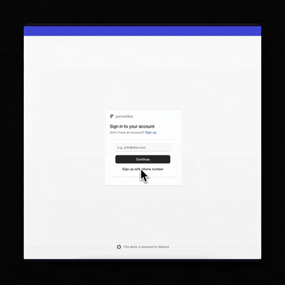

<p align="center">
  <a href="https://www.github.com/perseidesjs">
  <picture>
    <source media="(prefers-color-scheme: dark)" srcset="./.github/dark_mode.png" width="128" height="128">
    <source media="(prefers-color-scheme: light)" srcset="./.github/light_mode.png" width="128" height="128">
    
    </picture>
  </a>
</p>
<h1 align="center">
  @perseidesjs/auth-otp
</h1>

<p align="center">
  
  
</p>

<h4 align="center">
  <a href="https://perseides.org">Website</a> |
  <a href="https://www.medusajs.com">Medusa</a>
</h4>

<p align="center">
  An OTP Auth Provider for Medusa 2.x
</p>

> [!WARNING]
> This package is currently in alpha and NOT READY for use yet. Features may change without notice. Feel free to submit feature requests and bug reports through [GitHub Issues](https://github.com/perseidesjs/auth-otp/issues).

<p align="center">
  
</p>

## Features

- 🔐 Secure OTP-based authentication for Medusa 2.x
- ⚡ Easy integration with existing Medusa auth system
- ⚙️ Configurable OTP length and expiration
- 🔧 Built with TypeScript for better type safety

## Prerequisites

- Medusa.js (v2.x)
- Node.js (v20 or later)
- Cache module (Redis for production)

## Installation

```bash
yarn add @perseidesjs/auth-otp
```

2. Add the OTP provider to your Medusa configuration (`medusa-config.js`):

```ts
// In your medusa-config.js
module.exports = {
  // ... other configurations
  modules: [
    {
      resolve: "@medusajs/medusa/auth",
      options: {
        providers: [
          // ... other providers (or you can use otp only)
          {
            resolve: "@perseidesjs/auth-otp/providers/otp",
            id: "otp",
            dependencies: [Modules.CACHE, ContainerRegistrationKeys.LOGGER]
          },
        ],
      },
    }
  ],
}
```

## Configuration Options

The OTP provider can be configured with the following options:

```ts
{
  resolve: "@perseidesjs/auth-otp/providers/otp",
  id: "otp",
  dependencies: [Modules.CACHE, ContainerRegistrationKeys.LOGGER],
  options: {
    // Number of digits in the OTP code (default: 6)
    digits: 6,
    
    // Time-to-live for OTP codes in seconds (default: 300 - 5 minutes)
    ttl: 60 * 5,
    
    // Additional options will be documented as they become available
  }
}
```

## Usage

The OTP provider implements a two-step authentication flow:

### 1. Registration

To register a new auth identity and generate an OTP secret key:

```http
POST http://localhost:9000/auth/{actor_type}/otp/register
Content-Type: application/json

{
    "identifier": "user@example.com"
}
```

This will create a new auth identity and generate an OTP secret key that will be used for future authentications.

### 2. Authentication

The authentication process is done in two steps for security:

#### Step 1: Request OTP

```http
POST http://localhost:9000/auth/{actor_type}/otp/authenticate
Content-Type: application/json

{
    "identifier": "user@example.com"
}
```

> [!NOTE]
> For security reasons, this endpoint always returns a success message, regardless of whether the identifier exists or not. However, if no matching identity is found, a warning will be logged in the server console.

#### Step 2: Verify OTP

Once you receive the OTP (which is valid for the configured TTL), submit it:

```http
POST http://localhost:9000/auth/{actor_type}/otp/authenticate
Content-Type: application/json

{
    "identifier": "user@example.com",
    "otp": "123456"
}
```

Upon successful verification, you'll receive a JWT token that can be used for subsequent authenticated requests following the standard Medusa authentication flow.


## Roadmap

- [ ] Create a built-in workflow to automatically set up auth identities for different user types, enabling OTP as a secondary authentication method by default
- [ ] Implement an event system that triggers when users request OTP codes, making it easy to integrate with notification systems for delivering codes to users
- [ ] Add configuration option to control behavior when user identity is not found:
  - Option to return an error response
  - Option to return a success message (with server-side warning logs)

## License

This project is licensed under the [MIT License](LICENSE).